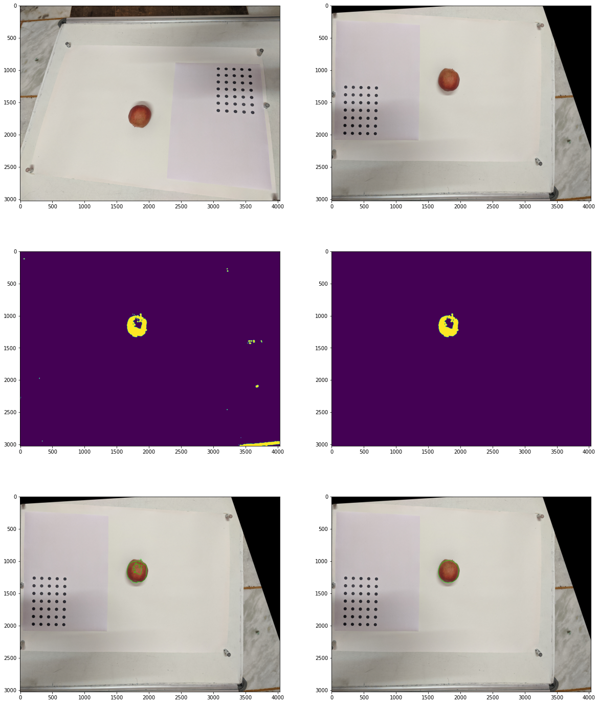
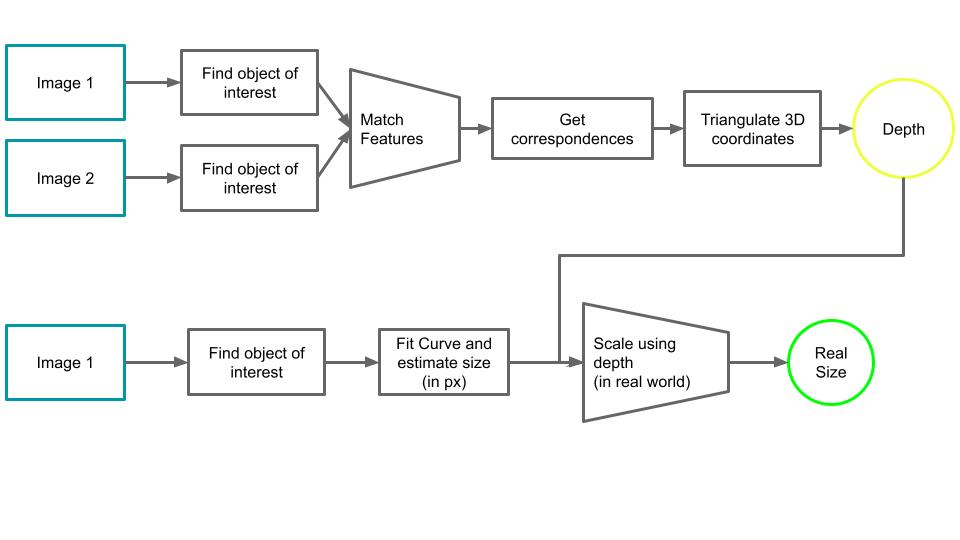
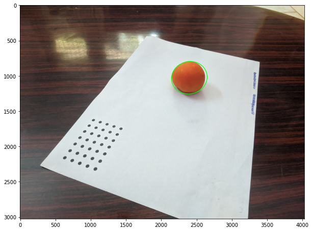

### Estimate the size of planar objects using a single image  

#### Steps:

1. Capture image of object containing the reference grid.
2. Calculate homography matrix between image and reference image.
3. perpective transform input image.
4. estimate size of object using reference's scale.
Output:  

```
d1, d2(in mm) = (66.41, 73.63), radius(in px) = 332.6036376953125, radius(in mm) = 70.02
```
  
<p align = "center"> 
    
    <br>
    Fig1. All intermediate steps in the monocular pipeline. The object size is estimated by warping the reference grid so that it becomes parallel to the image plane (through homography transformations). Then the object size is simply estimated from the warped image. 
</p>

#### Problem:  
Above technique works fairly well for planar objects, otherwise homography warps the image too much to get a reasonable estimate.

### Alternate: Using Multiple Images

#### Steps:

1. Capture images from different angles(all containing reference grid).
2. Match features of the object of interest.
3. Triangulate features to get the actual coordinates of the points(upto a scale).
4. Get actual coordinates in real world using scale of the reference grid.
5. Estimate mean depth of the object of interest.
6. Use depth to get actual size of the object.

The entire Multi-view Pipeline looks like this:
<p align = "center"> 
    
    <br>
    Fig 2. The entire Multi-view pipeline.
</p>

#### Output:   

```
translation and rotatation between the two camera positions:
Translation:
[[7.16284517]
[7.20515938]
[6.96448676]]
Rotation:
[[ 0.98178959  0.10522351 -0.15816829]
[-0.13342754  0.97460296 -0.17985037]
[ 0.1352268   0.19767923  0.97089476]]
=============================
Object distance: 52.060 cm
================================
Radii of ellipse: [7.916512582300231, 8.83417197121773]cm.
Average Radius of tomato: 8.375cm
```

<p align = "center"> 
    
    <br>
    Fig 3. Matched Features in the Multiview Pipeline
    <br>
    
    <br>
    Fig 4. Object Contour used to estimate the size
</p>
